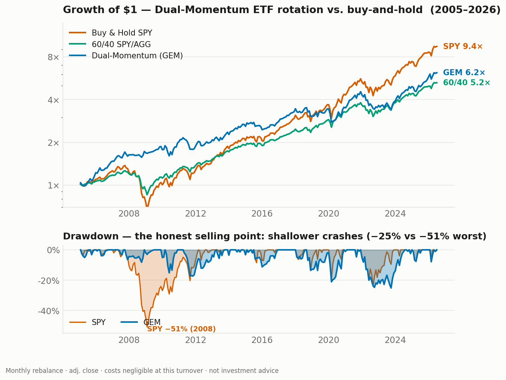

# Case study — Dual-Momentum ETF rotation: an honest screen

*What it looks like to evaluate a "sellable strategy" idea and report the verdict the
data gives, not the one I wanted.*

**The question.** Could a systematic ETF strategy be packaged as a product? The instinct
is reasonable — monthly-rebalanced rotation is **not** latency-bound, so the usual "a home
setup can't win in liquid markets" objection doesn't apply the way it does to intraday
timing. So I screened the canonical version: **Global Equities Momentum** (Antonacci) —
each month, hold US or international equities while their 12-month return beats T-bills,
rotate to bonds when it doesn't.

**The method.** Backtest 2004–2026, monthly, adjusted close, against two honest benchmarks:
buy-and-hold SPY and a trivial 60/40. The metric that matters for this pitch is **not**
raw return — it's risk-adjusted return and drawdown, because the only honest thing a
rotation like this can claim is "capture most of the upside, dodge the worst crashes."

| Strategy | CAGR | Vol | **Sharpe** | Max DD | Worst yr | 2008 | 2020 | 2022 |
|---|---|---|---|---|---|---|---|---|
| GEM dual-momentum | 8.8% | 12.1% | 0.76 | **−25.1%** | −22.5% | **+8%** | +3% | −23% |
| + defensive to cash | 8.4% | 11.8% | 0.75 | −24.8% | −20.7% | +7% | 0% | −21% |
| + volatility targeting | 7.2% | 10.1% | 0.74 | **−20.8%** | −18.4% | +7% | −7% | −18% |
| Buy & Hold SPY | 11.0% | 14.9% | 0.78 | −50.8% | −36.8% | −37% | +18% | −18% |
| 60/40 SPY/AGG | 8.0% | 9.5% | **0.86** | −32.3% | −21.1% | −21% | +15% | −16% |

**The verdict — the part I'd want a buyer to see.**

- **What's real:** the strategy **halves the worst drawdown** (−25% vs −51%) and made
  **+8% in 2008** while the market fell −37%. Crash protection is genuine and demonstrable.
- **What doesn't hold:** its **Sharpe (0.76) does not beat buy-and-hold (0.78), and loses
  to a trivial 60/40 (0.86)**. The two "improvements" I tested lower the drawdown further
  but **do not raise the Sharpe** — there's no risk-adjusted edge to unlock. It also
  whipsawed in 2020 (missed the V-recovery) and did *worse* than SPY in 2022.

So I **won't sell this as "better risk-adjusted returns"** — it isn't true, and a buyer
who re-runs the backtest sees it immediately. It's not snake-oil (it does reduce crashes),
but it isn't differentiated: a boring 60/40 dominates it on the metric that counts.

I also **stopped after three variants on purpose.** Hunting for the one parameterization
that finally "beats" the benchmark is p-hacking a backtest — and the buyers worth having
are exactly the ones who'd catch it. The honest number, warts shown, is the deliverable.

**Why this belongs in a showcase.** The sellable asset in systematic trading isn't a bot
that quietly beats the market — if it did, no one would sell it. It's the **process**:
rigorous, cost-aware, benchmarked against the dumb-simple alternative, and willing to
publish the result that kills its own pitch. That discipline is the same one that runs
through the rest of this platform — [back to the main writeup](../README.md).

Monthly rebalance · adjusted close · turnover-negligible costs · 2004–2026 is one
regime sample · not investment advice.
